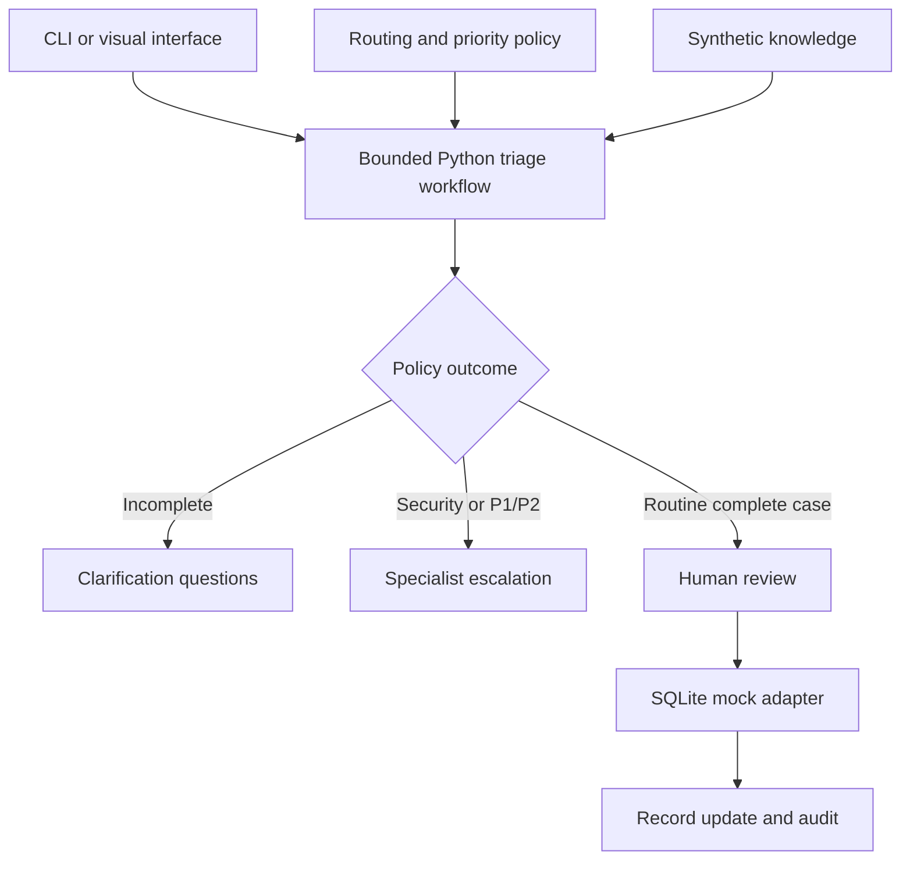
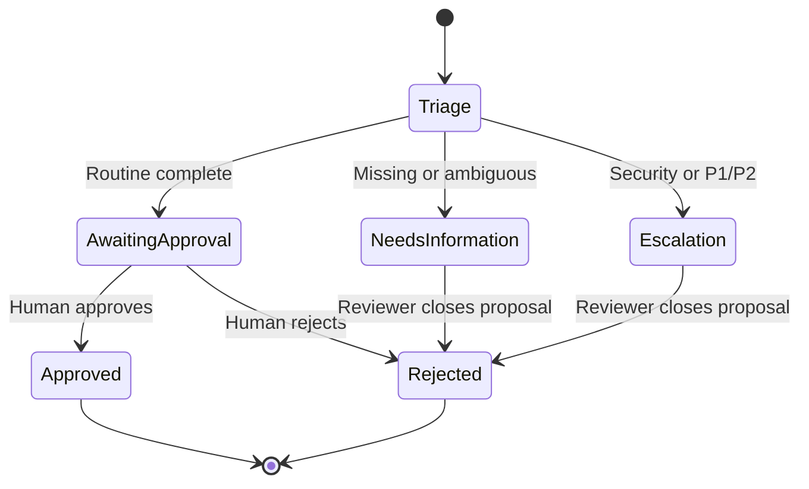

# Offline architecture

The Python engine is the single source of triage logic. The live visual UI calls it through HTTP; the portable snapshot embeds its generated outputs. JavaScript does not reimplement routing or priority rules.

## Engine steps

| Step | Tool boundary | Result |
|---|---|---|
| 1 | validate_incident | Reject invalid types/ranges; treat descriptions as data |
| 2 | classify_and_route | Security first, one route match, or clarification |
| 3 | calculate_priority | Explicit impact + urgency → lab lookup; missing → unknown |
| 4 | retrieve_knowledge | Filter synthetic knowledge by chosen category |
| 5 | apply_policy_gate | Escalation, needs information, or awaiting approval |

There is a finite sequence of five steps, not an open-ended planning loop. “Tool” describes a logical boundary here, rather than an AI Agent Studio tool implementation. This baseline establishes observable behavior before we add model uncertainty.

## Input/output contract

Input: `number` and `short_description` are required non-empty strings; `description` is optional text. `impact` and `urgency` accept integer 1/2/3 or null/missing. Display strings and ServiceNow reference objects must be normalized by a future adapter before calling this engine.

Output: run ID, incident number/revision, policy version, category, group display label, suggested priority, matched evidence, explanation, clarification questions, knowledge suggestions, three-field proposal, five-step trace, offline execution mode, and `automatic_write: false`.

The deterministic run ID hashes incident content, full policy, and knowledge so repeated runs against the same context reuse a proposal. It is truncated to 24 hexadecimal characters for this learning lab, not a security identity.

## State transitions

Clarification and escalation are recommendations, not implemented external notifications. Obtain new information or specialist review outside this prototype. Create a new proposal after updating the source through development fixtures or a future adapter; there is no UI that edits stored incidents yet.

## Local write controls

`Store.run()` stores a recommendation and audit without modifying the incident. `Store.decide()` validates the reviewer/decision, requires `awaiting_approval` for ordinary approval, checks the source revision and current policy/knowledge identity, then updates only category/group/work notes in a SQLite transaction. It increments the internal revision and logs the reviewer decision.

A repeated decision for the same run and same outcome is idempotent. A conflicting decision is rejected. Two simultaneous approvals result in one record update. The protection is per proposal: a new proposal after a record change is a new unit of work.

The adapter has no live HTTP client or credentials. Future integration must preserve these controls on the trusted server side, rather than rely on disabled UI buttons.

## Local HTTP contracts

| Method/path | Request | Response |
|---|---|---|
| GET `/api/health` | None | Offline adapter and access status |
| GET `/api/incidents` | None | Mock incident records |
| POST `/api/triage` | `{ "number": "INC-LAB-001" }` | Stored proposal and trace |
| POST `/api/preview` | Incident JSON | Preview-only result |
| POST `/api/decision` | `run_id`, `decision`, `reviewer` | Decision receipt |
| GET `/api/audit` | None | Ordered local history |

Invalid requests return 400, unknown IDs/routes return 404, conflicting or blocked decisions return 409. JSON is required for writes. Browser writes must come from the printed loopback origin. The server is a development server without authenticated identities.

## Future model extension

Replace the classification/retrieval strategy behind the same contract. Keep numerical priority, field allowlists, revision checks, approval checks, and transactional writes outside model control. Add structured model output validation, prompt-injection evaluations, redaction, recorded model/version metadata, cost/latency budgets, and a bounded retry policy before permitting any live execution. Compare model-assisted routing against this baseline on held-out cases.
